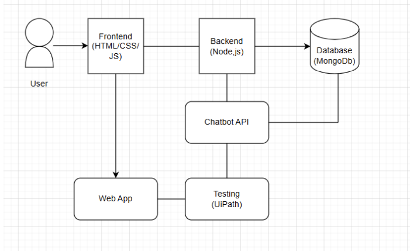

# MineGuard: Smart Mining Safety Assistant ⛑️

This project implements a full-stack AI-integrated platform designed to enhance safety in mining environments. It features a real-time dashboard for monitoring vital statistics and a Generative AI chatbot trained on safety protocols to assist workers in emergencies.

**Status:** Completed
**Tech Stack:** MERN Stack (MongoDB, Express, React, Node.js) / Google Gemini AI / UiPath

## 🌐 Overview

Mining operations are fraught with risks, requiring constant vigilance and immediate access to safety information. **MineGuard** addresses this by providing a centralized digital service platform. It combines real-time data visualization with an intelligent AI assistant capable of classifying emergency levels and providing instant, context-aware safety guidance. The system is rigorously tested using UiPath automation to ensure reliability.

## 💻 Interface Preview

*The MineGuard Landing Page & Dashboard, featuring real-time monitoring and safety alerts.*

## ⚙️ System Architecture

The solution is built on a robust 3-tier architecture:

* **Frontend (React + Vite):** A responsive Single Page Application (SPA) dashboard that visualizes worker status, environmental data, and hosts the chatbot interface.
* **Backend (Node.js + Express):** Handles API requests, user authentication (JWT), and manages the secure integration with the AI engine.
* **AI Engine (Google Gemini):** A generative AI model integrated into the backend to process safety queries, analyze sentiment, and provide emergency protocols.
* **Database (MongoDB):** Stores user profiles, safety logs, and simulated device data.

## 🔄 Functionality

The platform delivers three core functionalities:

1.  **AI Safety Chatbot:** Workers can ask natural language questions regarding safety procedures. The system uses Google Gemini to classify the "Emergency Tier" and generate a specific, grounded response.
2.  **Live Monitoring Dashboard:** Displays simulated telemetry data from wearable devices, including heart rate, battery levels, and gas sensor readings.
3.  **Automated Testing:** The core workflows (Login, Registration, Chatbot Response) are validated using **UiPath** RPA bots to simulate real-world usage scenarios.

## 📐 Architecture Diagram

Visual representation of the data flow between the User, Frontend, Backend, and AI services.

## 🛠 Requirements

To run this project locally, you will need:

* **Runtime:** Node.js (v18.0+) and npm.
* **API Keys:** Google Gemini API Key and MongoDB Connection URI (configured in `.env`).
* **Testing:** UiPath Studio (Optional, for running automation scripts).

## 🚀 Setup & Execution

1.  **Install Dependencies:** Run `npm run install:all` in the root directory to install packages for both backend and frontend.
2.  **Start Application:** Run `npm run start:dev` to launch both servers concurrently.
    * **Frontend:** `http://localhost:3000`
    * **Backend:** `http://localhost:5000`

## 📂 Folder Structure

* `backend/` — Server-side logic, API routes, and AI integration.
* `frontend/` — Client-side React application and UI components.
* `package.json` — Root configuration scripts.
* `Dashboard_Preview.png` — Screenshot of the web interface.
* `Architecture_Diagram.png` — System design visual.
* `README.md` — Project documentation.