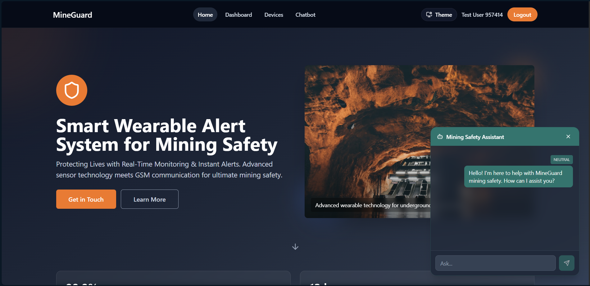
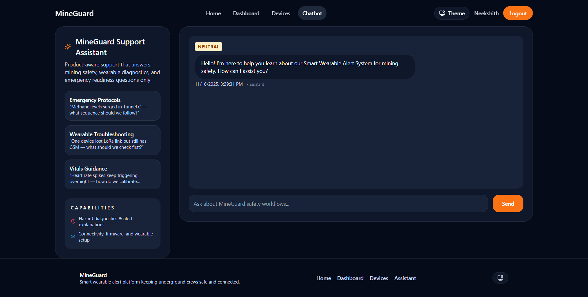
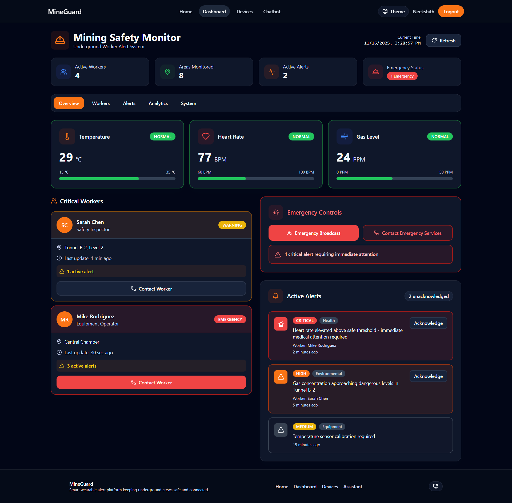
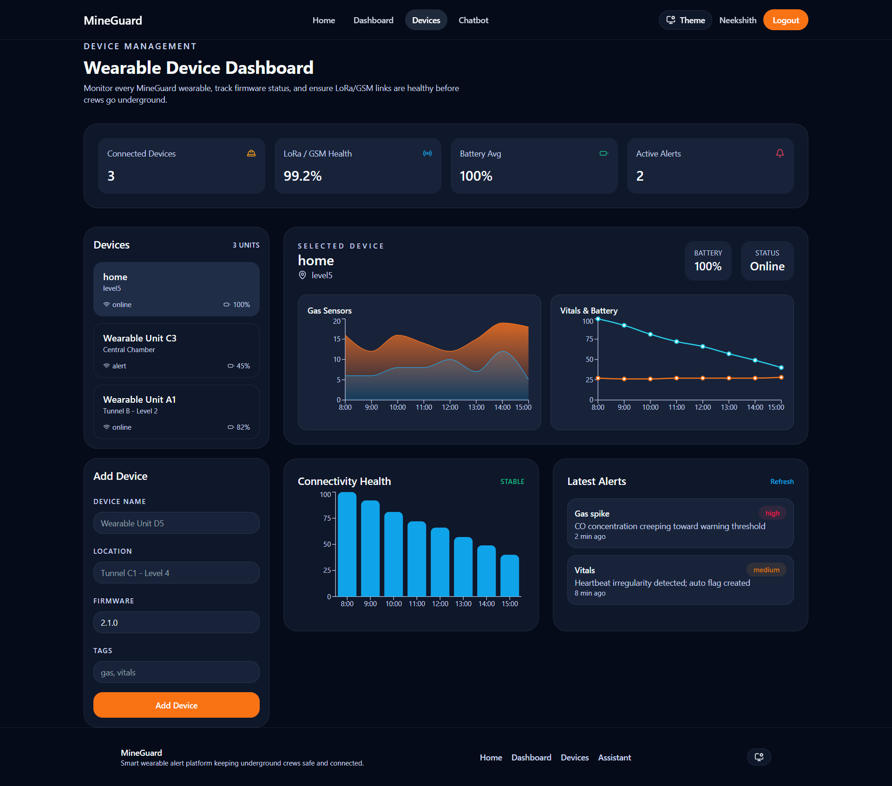
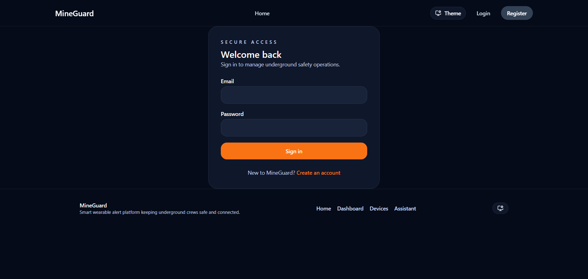

# MineGuard: AI-Integrated Mining Safety Platform ⛑️

**MineGuard** is a full-stack MERN application designed for mining safety monitoring.

Unlike traditional static prototypes, this project features a **Device Simulation Engine**: it allows users to register "virtual" devices, which then generate realistic, randomized telemetry (Heart Rate, Gas Levels, Battery) to demonstrate how a real-time safety dashboard would function in a live scenario.

---

## 🚀 Key Features

### 1. 🌗 Dynamic Dark & Light Theme
The application adapts to the user's environment with a built-in **Theme Toggle**:
* **Dark Mode:** Optimized for low-light underground control centers.
* **Light Mode:** Designed for standard office monitoring.

### 2. 🤖 Dual-Mode AI Safety Assistant (Google Gemini)
An intelligent safety expert is integrated directly into the workflow:
* **Floating Widget:** A global chat button on the home page for instant, on-the-fly assistance.
* **Dedicated Support Hub:** A full-screen interface for resolving complex safety protocols and troubleshooting hardware.

### 3. 🖥️ Real-Time Safety Dashboard
The central command center provides instant visibility into worker status:
* **Live Visualization:** Dynamic progress bars and indicators for Temperature, Heart Rate, and Gas Levels.
* **Smart Alerting:** The system automatically flags "Critical" or "High" severity readings with visual cues to prompt immediate action.

### 4. 📡 Device Simulation & Management
Designed for flexibility, the platform includes a **Virtual Device Engine**:
* **Add Device:** Register new wearable units to the fleet via a secure dashboard.
* **Data Stream:** The system generates realistic telemetry streams for registered devices, allowing administrators to test safety logic and alert responsiveness without requiring physical hardware connections.

### 5. 🔐 Secure Authentication
* **Enterprise-Grade Access:** Secure **Login** and **Registration** flows protect sensitive operational data.
* **Security Standards:** Implements **JSON Web Tokens (JWT)** and **Bcrypt** hashing for robust session management.

---
## 📸 Interface Gallery (Cropped Previews)

<table width="100%">
<tr>

<td width="50%" align="center">
  <div style="height:220px; overflow:hidden; border-radius:12px;">
    
  </div>
  <strong>Landing Page</strong>
</td>

<td width="50%" align="center">
  <div style="height:220px; overflow:hidden; border-radius:12px;">
    
  </div>
  <strong>Floating AI Widget</strong>
</td>

</tr>
<tr>

<td width="50%" align="center">
  <div style="height:220px; overflow:hidden; border-radius:12px;">
    
  </div>
  <strong>AI Support Hub</strong>
</td>

<td width="50%" align="center">
  <div style="height:220px; overflow:hidden; border-radius:12px;">
    
  </div>
  <strong>Safety Dashboard</strong>
</td>

</tr>
<tr>

<td width="50%" align="center">
  <div style="height:220px; overflow:hidden; border-radius:12px;">
    
  </div>
  <strong>Device Telemetry</strong>
</td>

<td width="50%" align="center">
  <div style="height:220px; overflow:hidden; border-radius:12px;">
    
  </div>
  <strong>Secure Login</strong>
</td>

</tr>
<tr>

<td width="50%" align="center">
  <div style="height:220px; overflow:hidden; border-radius:12px;">
    
  </div>
  <strong>User Registration</strong>
</td>

<td></td>

</tr>
</table>

---

## 📂 Project Structure

```
etprojectcode/
├── backend/
│   ├── models/       # Database Schemas (User, Device, Record)
│   ├── routes/       # API Endpoints (Auth, Chatbot, Devices)
│   ├── middleware/   # Security & Auth Middleware
│   └── index.js      # Server Entry Point
├── frontend/
│   ├── src/
│   │   ├── components/  # Reusable UI (Navbar, Alerts, Charts)
│   │   ├── pages/       # Core Views (Home, Dashboard, Chatbot)
│   │   ├── context/     # Global State (Theme)
│   │   └── api/         # Axios Configuration
│   └── vite.config.js
└── package.json      # Root Dependencies
```

---

## 🛠️ Tech Stack

* **Frontend:** React.js, Vite, Tailwind CSS
* **Backend:** Node.js, Express.js
* **Database:** MongoDB & Mongoose
* **AI Engine:** Google Gemini API
* **Visualization:** Recharts

---

## ⚙️ Execution Instructions

**Prerequisites:** Node.js (v18+) and MongoDB.

1. **Install Dependencies:**
   Run the setup script from the root directory:
   ```bash
   npm run install:all
   ```

2. **Environment Configuration:**
   Create a `.env` file in the `backend/` folder based on the example provided:
   ```env
   MONGO_URI=your_mongodb_connection_string
   GEMINI_API_KEY=your_google_api_key
   JWT_SECRET=your_jwt_secret
   ```

3. **Run the Platform:**
   Start the frontend and backend concurrently:
   ```bash
   npm run start:dev
   ```
   - **Web Interface:** http://localhost:3000
   - **API Server:** http://localhost:5000

---

> **ℹ️ Note:** This is a web-based simulator demonstrating full-stack logic and AI integration. All data is synthetic and generated for testing purposes.
